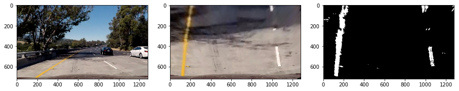

---

**Advanced Lane Finding Project**

The goals / steps of this project are the following:

* Compute the camera calibration matrix and distortion coefficients given a set of chessboard images.
* Apply a distortion correction to raw images.
* Use color transforms, gradients, etc., to create a thresholded binary image.
* Apply a perspective transform to rectify binary image ("birds-eye view").
* Detect lane pixels and fit to find the lane boundary.
* Determine the curvature of the lane and vehicle position with respect to center.
* Warp the detected lane boundaries back onto the original image.
* Output visual display of the lane boundaries and numerical estimation of lane curvature and vehicle position.

[//]: # (Image References)

[image1]: ./examples/undistort_output.png "Undistorted"
[image2]: ./test_images/test1.jpg "Road Transformed"
[image3]: ./examples/binary_combo_example.jpg "Binary Example"
[image4]: ./examples/warped_straight_lines.jpg "Warp Example"
[image5]: ./examples/color_fit_lines.jpg "Fit Visual"
[image6]: ./examples/example_output.jpg "Output"
[video1]: ./project_video.mp4 "Video"

## [Rubric](https://review.udacity.com/#!/rubrics/571/view) Points

### Here I will consider the rubric points individually and describe how I addressed each point in my implementation.  

---

### Writeup / README

### Camera Calibration

#### 1. Briefly state how you computed the camera matrix and distortion coefficients. Provide an example of a distortion corrected calibration image.

The code for this step is contained in the first and second code cell of the IPython notebook located in "./Advanced Lane Detection.ipynb".

I start by preparing "object points", which will be the (x, y, z) coordinates of the chessboard corners in the world. Here I am assuming the chessboard is fixed on the (x, y) plane at z=0, such that the object points are the same for each calibration image with 9x6 size.  Thus, `objp` is just a replicated array of coordinates, and `object_points` will be appended with a copy of it every time I successfully detect all chessboard corners in a test image. A number of images of a chessboard, taken from different angles with the same camera, comprise the input. Using `cv2.findChessboardCorners()` function with grayscaled images, `image_points` are detected and will be appended with the (x, y) pixel position of each of the corners in the image plane with each successful chessboard detection. The below images depict the corners drawn onto twenty chessboard images using `cv2.drawChessboardCorners()` function.


You can find a few images don't appear as `cv2.findChessboardCorners()` failed to detect the desired number of internal corners.

I then used the output `object_points` and `image_points` to compute the camera calibration and distortion coefficients using the `cv2.calibrateCamera()` function. I applied this distortion correction to the test image using the `cv2.undistort()` function and obtained this result: 


### Pipeline (single images)

#### 1. Provide an example of a distortion-corrected image.

To demonstrate this step, I will describe how I apply the distortion correction to one of the test images like this one:


I applied the calibration matrix and distortion coefficient, which were got from the previous cells. `mtx`, `dist` are fed to undistort the test image above.
```python
 def undistort(self, image):
        """Undistort the image given the calibration matrix and distortion coefficients"""
        undistorted_image = cv2.undistort(image, self.calibration.mtx, self.calibration.dist, None, self.calibration.mtx)
        return undistorted_image
```

The resulting output seems subtle, but it can be be perceived from the difference in shape of the animal warning traffic sign and the hood of the car at the bottom of the image. The traffic sign in the undistorted image looks more like front view perspective.

#### 2. Describe how (and identify where in your code) you used color transforms, gradients or other methods to create a thresholded binary image.  Provide an example of a binary image result.

I used a combination of color and gradient thresholds to generate a binary image. The code for each color and gradient thresholding is in the `Pipeline` cell of IPython jupyter notebook. 
Regarding to color thresholding first, I found the all channels of RGB and Grayscaled images are very poor at detecting the lane lines especilly when the lighting condition are too bright. The weakness for those color space is clearly shown as below:


To overcome this issue, I chose HLS and Lab color space to find lane lines with high reliability. The `S` channel from the HLS space and `b` channel from the Lab space are finally chosen and combined because those two channels were able to provide with a quite clear detection information despite the light changes and various lane colors.

Second, I applied both `x` and `y` Sobel gradient and combined them with the `magnitude` and `directional` gradients as well. As directional gradients tend to be much sensitive to noise, I had to finely tune the threshold for each channel to be minimally talerant to the changes in lighting.

Then fianlly those color transforms and gradient thresholding are combined to form a binary image. After a few back-and-forward exploration with thresholds in each channel, I got the following result of output as below. 


#### 3. Describe how (and identify where in your code) you performed a perspective transform and provide an example of a transformed image.

The code for my perspective transform includes a function called `warp()`, which appears in lines 167 through 222 of `Pipeline` class in the notebook `Advanced Lane Detection.ipynb`. The `warp()` function takes the combined thresholding image (`img`) as inputs, and does a perspective transform with source (`src`) and destination (`dst`) points which I chose the hardcode in the following manner:

```python

    def warp(self, image):
        """Define calibration box in source (original) and destination (desired or warped) coordinates"""

        image_size = (image.shape[1], image.shape[0])
        
        # Four source coordinates
        src =  np.float32(
            [[500, 480],
            [810, 482],
            [1250, 720],
            [40, 720]])
        
        # Four desired coordinates
        dst = np.float32(
            [[0, 0],
            [1200, 0],
            [1200, 720],
            [0, 720]]) 

        # Compute the perspective transform, M
        M = cv2.getPerspectiveTransform(src, dst)
    
        # Compute the inverse transform by swapping the input parameters
        M_inv = cv2.getPerspectiveTransform(dst, src)
    
        # Create warped image - uses linear interpolation
        warped_image = cv2.warpPerspective(image, M, image_size, flags=cv2.INTER_LINEAR)
        
        return warped_image, M, M_inv
```

This resulted in the following source and destination points:

| Source        | Destination   | 
|:-------------:|:-------------:| 
| 500, 480      | 0, 0        | 
| 810, 482      | 1200, 0      |
| 1250, 720     | 1200, 720      |
| 40, 720      | 0, 720        |

I verified that my perspective transform was working as expected by drawing the `src` and `dst` points onto a test image and its warped counterpart to verify that the lines appear parallel in the warped image.
I was struggling to choose the right source and destination points. I first tried to choose the points which were used in the lecture#16 Camera calibration, but it didn't give me a desired output when the curves were severe. So, I spent some time to find out the right points and finally I could get the following results of the perspective transforms.





#### 4. Describe how (and identify where in your code) you identified lane-line pixels and fit their positions with a polynomial?
To detect the lane lines, I applied the sliding window method that I learnt from the Udacity lecture. The code is in the `find_lane_pixels` of the `Pipeline` class.
It firstly calculates a histogram of one third of the bottom of the image and finds the bottom-most x position (or "base") of the left and right lane lines. Then, it places a window from the place and updates its center point from bottom to top, searching for the number of activated pixels. The window effectively follows the lane lines of the binary image and speeds up processing by only searching for the activated pixels(white pixels) over a small portion of the image. When the number of pixels in the window is less than the minimum number of points, which is determined by user, then it keeps its position without changing the direction. Pixels belonging to each window are all identified and they're fit to a 2nd order polynomial using `np.polyfit()` function. The image below demonstrates how this process works.


The image below depicts the histogram resulting the base points for the left and right lanes. The two peak points of each left and right lane are clearly visible.


#### 5. Describe how (and identify where in your code) you calculated the radius of curvature of the lane and the position of the vehicle with respect to center.

The calculation of the radius of curvature is based upon this [website](https://www.intmath.com/applications-differentiation/8-radius-curvature.php). Using the formula introduced in the [website](https://www.intmath.com/applications-differentiation/8-radius-curvature.php), I coded it in that following way:

```python
        # Choose maximum y-value corresponding to the bottom of the image (evaluation for radius of curvature)
        y_eval = np.max(ploty)*ym_per_pix # Real-world conversion
        
        #Calculation of R_curve (Formulation for radius of curvature)
        left_curvature = ((1 + (2*left_fit_m[0]*y_eval + left_fit_m[1])**2)**(3/2)) / np.absolute(2*left_fit_m[0])
        right_curvature = ((1 + (2*right_fit_m[0]*y_eval + right_fit_m[1])**2)**(3/2)) / np.absolute(2*right_fit_m[0])
        center_curvature = np.mean([left_curvature, right_curvature])
```
where `fit` is the array containing the polynomial coefficients, `y_eval` is the maximum Y value to evaluate the curvature in the current position of vehicle. Notice that `y_eval` is a value converted from pixel unit to meter for real-world representation.

The position of the vehicle with respect to the center of the lane is calculated with the following codes:

```python
        # Calculate vehicle center
        x_max = image.shape[1]*xm_per_pix
        y_max = image.shape[0]*ym_per_pix
        vehicle_center = x_max/2
        
        # Calculate lane center
        lane_left = left_fit_m[0]*y_max**2 + left_fit_m[1]*y_max + left_fit_m[2]
        lane_right = right_fit_m[0]*y_max**2 + right_fit_m[1]*y_max + right_fit_m[2]
        lane_center = (lane_left + lane_right)/2
        
        # Calculate the lateral offset between vehicle center and lane center
        lateral_offset = vehicle_center - lane_center
```
Make sure that the `vehicle's center point` is calculated by `x_max/2` with the assumption that camera is exactly mounted in the front center of the vehicle.
Moreover, `lane_left` and `lane_right` are the x-intercepts of the right and left fits, respectively. These require evaluating the fit at the maximum y value (719 in this case - the bottom of the image). Then finally, I can get the car's position by calculating the difference between the `lane_center` and the `vehicle_center`


#### 6. Provide an example image of your result plotted back down onto the road such that the lane area is identified clearly.

I implemented the last step in the `draw_lane` function of the notebook. A polygon is generated based on plots of the left and right fits, and warped back to the perspective of the image using the inverse warping matrix `Minv`. The finally it overlaid onto the original image. Here is an example of my result on a test image:


---

### Pipeline (video)

#### 1. Provide a link to your final video output. Your pipeline should perform reasonably well on the entire project video (wobbly lines are ok but no catastrophic failures that would cause the car to drive off the road!).

Here's a [link to my video result](./project_video_output.mp4)

---

### Discussion

#### 1. Briefly discuss any problems / issues you faced in your implementation of this project.  Where will your pipeline likely fail?  What could you do to make it more robust?

The pipeline was able to detect and track the lanes quite reliably in the original project video with some experiments of gradient and color channel thresholding. The problems I mostly encountered were due to lighting conditions, shadow, discoloration, etc. After discovering the S channel of the HLS and B channel of the Lab color space, the yellow lines became visible, even in the lighter-gray bridge section, which was one of the most difficult sections of the project video.

I tried to extend the same pipeline to the challenge video, but I found that the lane lines were not very detectable using the same pixel value range of the first video. The challenge video has a section where the car goes underneath a turnnel and no lanes are detected. When the large noisy areas activated in the binary image came up, the white lines didn't contrast well with the rest of the image, so that the detector totally got lost. I think this would definitely be a critical issue in snow or in a situation where a bright white car were driving among dull white lane lines.

I've considered several possible approaches for making my pipeline more robust.
First, dynamic thresholding. Selecting the seperate threshold values for different horizontal slices of the image would be able to deal with more various lighting conditions.
Second, using a confidence level for fits and rejecting new fits that deviate beyond a certain amount. Rejecting the right fit, which is generally less confident than left fit, would work better when the confidence in the left fit is much high and right fit deviates too much.

I'll revisit here and try with new strategies to work out the challenge video in the near future.


